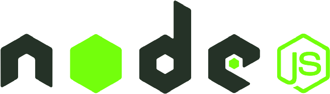

# ABOUT THE PROJECT

### This nice React app built around the MARVEL API to display all the comics and Characters from marvel COMICS® ... enjoy!!!

  

## SCREENSHOTS

   
   
   
   

## BUILT WITH

- 
- 
- 

## FEATURES

- signin and login screen
- display all the comics and characters with autocomplete
- Blog post to discuss about your favorite characters
